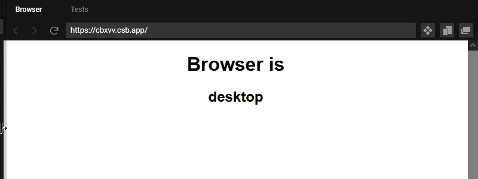

<div id="top"></div>


<!-- PROJECT SHIELDS -->

[](https://github.com/tufantunc/useIsMobile/actions/workflows/node.js.yml)


[](https://github.com/semantic-release/semantic-release)


<br />
<div align="center">
  <h3 align="center">useIsMobile</h3>
  <p align="center">
    A simple React hook that provides a boolean for the screen is mobile or not. 
    <br />
    Supports React 16.8+, 17, 18, and 19.
    <br />
    <br />
    <a href="https://codesandbox.io/s/useismobile-example-v2-s4l05e?file=/src/App.js" target="_blank">View Demo</a>
    ·
    <a href="https://github.com/tufantunc/useIsMobile/issues">Report Bug</a>
    ·
    <a href="https://github.com/tufantunc/useIsMobile/issues">Request Feature</a>
  </p>
</div>

<!-- TABLE OF CONTENTS -->
<details>
  <summary>Table of Contents</summary>
  <ol>
    <li>
      <a href="#about-the-project">About The Project</a>
      <ul>
        <li><a href="#built-with">Built With</a></li>
      </ul>
    </li>
    <li>
      <a href="#getting-started">Getting Started</a>
      <ul>
        <li><a href="#prerequisites">Prerequisites</a></li>
        <li><a href="#installation">Installation</a></li>
      </ul>
    </li>
    <li><a href="#usage">Usage</a></li>
    <li><a href="#contributing">Contributing</a></li>
    <li><a href="#license">License</a></li>
    <li><a href="#contact">Contact</a></li>
  </ol>
</details>

<!-- ABOUT THE PROJECT -->
## About The Project



useIsMobile is a custom hook for React. It gives you a boolean for the screen is mobile or not.

<p align="right">(<a href="#top">back to top</a>)</p>

### Built With
* [React.js](https://reactjs.org/)
* [Babel](https://babeljs.io/)
* [Jest](https://jestjs.io/)
* [Semantic Release](https://semantic-release.gitbook.io)

<p align="right">(<a href="#top">back to top</a>)</p>

<!-- GETTING STARTED -->
## Getting Started

### Prerequisites

React and ReactDOM must be installed in your project (supports React 16.8+, 17, 18, and 19).
* npm
  ```sh
  npm install react react-dom
  ```

### Installation

1. Install via npm
   ```sh
   npm install useismobile
   ```
2. Install via yarn
   ```sh
   yarn add useismobile
   ```

<p align="right">(<a href="#top">back to top</a>)</p>

<!-- USAGE EXAMPLES -->
## Usage

You can see a basic usage example at [codespace demo](https://codesandbox.io/s/useismobile-example-v2-s4l05e?file=/src/App.js)

<p align="right">(<a href="#top">back to top</a>)</p>


<!-- CONTRIBUTING -->
## Contributing

Any contribution is welcome.

Commitizen standardizes to commit messages,
just don't forget to use npm commit command.

1. Fork the Project
2. Create your Feature Branch (`git checkout -b feature/AmazingFeature`)
3. Make your changes.
4. Commit your Changes with npm (`npm run commit`)
5. Push to the Branch (`git push origin feature/AmazingFeature`)
6. Open a Pull Request

<p align="right">(<a href="#top">back to top</a>)</p>

<!-- LICENSE -->
## License

Distributed under the MIT License. See `LICENSE` for more information.

<p align="right">(<a href="#top">back to top</a>)</p>


<!-- CONTACT -->
## Contact

Tufantunc - [@tufant](https://twitter.com/tufant)

Project Link: [https://github.com/tufantunc/useismobile](https://github.com/tufantunc/useismobile)

<p align="right">(<a href="#top">back to top</a>)</p>

